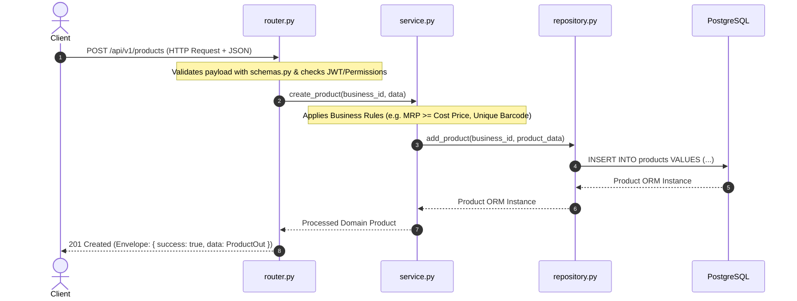

# Vyapaari+ — Enterprise Multi-Tenant AI-Powered MSME Platform

[](https://python.org)
[](https://fastapi.tiangolo.com)
[](https://www.sqlalchemy.org)
[](https://www.postgresql.org)
[](https://redis.io)
[](https://docs.celeryq.dev)
[](https://github.com/astral-sh/ruff)
[](LICENSE)

> **Vyapaari+** is a production-grade, modular-monolith backend engine built for high-throughput Indian MSME billing, multi-branch inventory management, automated financial reporting, and predictive AI analytics.

---

## 🌟 Executive Overview

Vyapaari+ is engineered as a **Modular Monolith** applying **Clean Architecture** principles. Rather than collapsing 10+ core domains into a flat API layout, every business unit (Billing, Inventory, AI, Auth, Finance) is organized as a self-contained, domain-driven module with strict separation between HTTP routing, domain business logic, and database persistence layers.

### Key Highlights
- 🏢 **Strict Multi-Tenant Isolation:** `business_id` scoping enforced across all database queries and API routes.
- ⚡ **Strict 3-Layer Clean Pattern:** `Router` (HTTP) → `Service` (Business Rules) → `Repository` (DB Queries).
- 🤖 **Standalone AI Engine:** Independent analytics pipeline (`ai/`) covering Prophet demand forecasting, OCR invoice extraction, and LLM business advisories.
- 🛡️ **Production-Ready Security:** OAuth2 JWT authentication, bcrypt password hashing, RBAC permission guards, and rate-limiting.
- 🔄 **Async Processing Queue:** Background job processing powered by Redis and Celery.

---

## 📁 Repository Structure

```text
vyapaari-plus/
│
├── backend/
│   ├── app/
│   │   ├── main.py                  # FastAPI app initialization & global middlewares
│   │   ├── config.py                # Type-safe configuration via pydantic-settings
│   │   ├── dependencies.py          # Global FastAPI dependencies (get_db, get_current_user)
│   │   │
│   │   ├── core/                    # Cross-cutting concerns (no business logic)
│   │   │   ├── security.py          # JWT sign/verify, password hashing, OTP generator
│   │   │   ├── exceptions.py        # Centralized custom HTTP exception definitions
│   │   │   ├── middleware.py        # Request ID tracking, CORS, security headers, rate-limiting
│   │   │   ├── logging.py           # Structured JSON logging setup
│   │   │   ├── permissions.py       # Role-based Access Control (RBAC) guards
│   │   │   └── celery_app.py        # Celery worker instance & configuration
│   │   │
│   │   ├── db/
│   │   │   ├── base.py              # SQLAlchemy 2.0 Base declarative class & engine factory
│   │   │   ├── session.py           # Async/Sync database session handlers
│   │   │   └── mixins.py            # TimestampMixin, SoftDeleteMixin, UUIDMixin
│   │   │
│   │   ├── modules/                 # ⭐ SELF-CONTAINED BUSINESS MODULES
│   │   │   ├── auth/                # Login, signup, password reset, token refresh
│   │   │   ├── business/            # Shop, branch, and company profile settings
│   │   │   ├── products/            # Catalog, categories, brands, variants
│   │   │   ├── inventory/           # Stock levels, transfers, audit logs, low-stock alerts
│   │   │   ├── billing/             # Invoices, GST calculations, POS checkout, discounts
│   │   │   ├── customers/           # Ledger, credit limits, loyalty points
│   │   │   ├── suppliers/           # Purchase orders, vendor management, payables
│   │   │   ├── employees/           # Staff roles, attendance, access permissions
│   │   │   ├── finance/             # Expense tracking, cashbook, P&L aggregation
│   │   │   ├── reports/             # PDF/Excel export generation, analytics summaries
│   │   │   ├── notifications/       # SMS, WhatsApp, and Email triggers
│   │   │   └── ai/                  # REST entrypoints for AI advisories & forecasts
│   │   │
│   │   ├── shared/                  # Utilities shared across business modules
│   │   │   ├── schemas.py           # Standardized API response envelopes & pagination models
│   │   │   ├── utils.py             # Date formatting, string helpers, currency convertors
│   │   │   └── constants.py         # Global enums, status codes, system defaults
│   │   │
│   │   └── tasks/                   # Celery background job registries
│   │       ├── report_tasks.py      # Scheduled & async PDF/Excel report workers
│   │       ├── notification_tasks.py# Async WhatsApp/Email dispatchers
│   │       └── ai_tasks.py          # Nightly forecasting & model execution jobs
│   │
│   ├── ai/                          # 🧠 AI/ML PIPELINE ENGINE (Decoupled from core app)
│   │   ├── forecasting/             # Prophet-based sales & inventory demand prediction
│   │   ├── recommendations/         # Dynamic pricing & stock replenishment engine
│   │   ├── insights/                # Dead stock detection, profit margin anomaly detection
│   │   ├── advisor/                 # LLM-based conversational business advisor
│   │   ├── ocr/                     # Bill & vendor invoice OCR parsing pipeline
│   │   ├── pipelines/               # Offline training & inference execution pipelines
│   │   └── models/                  # Saved ML models (.pkl, .joblib — GitIgnored)
│   │
│   ├── alembic/                     # DB migration scripts
│   │   ├── versions/
│   │   └── env.py
│   │
│   ├── tests/                       # Automated test suite
│   │   ├── unit/                    # Mirrors modules/ directory structure
│   │   ├── integration/             # End-to-end API integration tests
│   │   ├── conftest.py              # Pytest fixtures (isolated test DB, async test client)
│   │   └── factories/               # factory_boy model factories for mock data
│   │
│   ├── scripts/                     # Admin scripts (database seed, backfills, benchmark)
│   ├── .env.example                 # Template for environment variables (No secrets!)
│   ├── pyproject.toml               # Poetry/Tooling configuration (Ruff, Black, Mypy, Pytest)
│   ├── alembic.ini                  # Migration engine config
│   ├── Dockerfile                   # Multi-stage production container manifest
│   └── docker-compose.yml           # Orchestration manifest (App, Postgres, Redis, Celery)
│
├── frontend/                        # Next.js Web Portal (Monorepo placeholder)
├── mobile/                          # Flutter Mobile Application (Monorepo placeholder)
├── docs/                            # Developer & Architecture documentation
├── deployment/                      # Nginx configs, Docker assets, CI/CD scripts
└── README.md
```

---

## 🏛️ Internal Module Blueprint

Every business domain within `backend/app/modules/` adheres to a strict 3-layer architectural contract:

```text
modules/products/
├── __init__.py
├── router.py          # HTTP Layer: FastAPI APIRouter, request validation via schemas.py
├── schemas.py          # Data Contract: Pydantic V2 request & response models
├── models.py            # DB Schema: SQLAlchemy 2.0 ORM Models
├── service.py            # Business Layer: Business logic & validation (framework-agnostic)
├── repository.py          # Persistence Layer: Raw SQL / SQLAlchemy queries ONLY
├── exceptions.py            # Domain Errors: Module-specific exception definitions
├── permissions.py             # Access Control: RBAC rules for module operations
└── dependencies.py              # Injectables: Module-specific FastAPI Depends()
```

### Clean Data Flow Cycle


---

## 🔒 Architectural Principles & Guidelines

### 1. Multi-Tenant Data Isolation (Mandatory)
Every business table must inherit from `BusinessScopedMixin` (or explicitly contain a `business_id` foreign key referencing the `businesses` table).
- **Rule:** Repositories must filter queries by `business_id` without exception.
- **Goal:** Prevent accidental cross-tenant data leaks.

### 2. Strict Layer Separation
- **`router.py`**: Handles request parsing, status codes, and HTTP exceptions. **No SQL queries allowed.**
- **`service.py`**: Executes business rules, orchestrates tasks, and triggers notifications. **No direct `db.query()` calls allowed.**
- **`repository.py`**: Manages all database queries. **No HTTP or business logic handling allowed.**

### 3. Database Model Standard Mixins
All models must inherit baseline mixins from `app.db.mixins`:
```python
from app.db.base import Base
from app.db.mixins import UUIDMixin, TimestampMixin, SoftDeleteMixin

class Product(Base, UUIDMixin, TimestampMixin, SoftDeleteMixin):
    __tablename__ = "products"
    
    name = Column(String(255), nullable=False)
    business_id = Column(UUID, ForeignKey("businesses.id"), nullable=False, index=True)
```

### 4. Uniform API Response Envelope
All API endpoints return a standardized JSON structure defined in `app/shared/schemas.py`:
```json
{
  "success": true,
  "message": "Product created successfully",
  "data": {
    "id": "9b1deb4d-3b7d-4bad-9bdd-2b0d7b3dcb6d",
    "name": "Basmati Rice 5kg",
    "price": 450.00
  },
  "errors": null
}
```

---

## ⚡ Quickstart & Local Setup

### Prerequisites
- **Python 3.12+**
- **Docker & Docker Compose**
- **PostgreSQL 16+** & **Redis 7+** (or use local Docker services)

### 1. Clone Repository & Environment Setup
```bash
git clone https://github.com/mohitraj8503/vyapaari-plus.git
cd vyapaari-plus/backend

# Create virtual environment
python3.12 -m venv venv
source venv/bin/activate

# Install dependencies
pip install -r requirements.txt
```

### 2. Configure Environment Variables
Copy `.env.example` to `.env` and update secrets:
```bash
cp .env.example .env
```

> ⚠️ **SECURITY WARNING:** Never commit real secrets, DB credentials, or API keys to git. Keep `.env` gitignored at all times.

### 3. Launch Core Infrastructure via Docker
```bash
docker-compose up -d postgres redis
```

### 4. Execute Migrations & Seed Database
```bash
# Run Alembic migrations
alembic upgrade head

# Seed initial system roles & test data
python scripts/seed_db.py
```

### 5. Start Application Server & Workers
```bash
# Start FastAPI Dev Server
uvicorn app.main:app --reload --port 8000

# Start Celery Worker (In a separate terminal)
celery -A app.core.celery_app worker --loglevel=info
```

FastAPI Interactive API Documentation:
- **Swagger UI:** `http://localhost:8000/docs`
- **ReDoc:** `http://localhost:8000/redoc`

---

## 🧪 Testing & Code Quality Baseline

Vyapaari+ enforces automated linting, strict static typing, and high test coverage.

### Run Linter & Type Checks
```bash
# Code linting & formatting checks via Ruff
ruff check .
ruff format --check .

# Static type checking via Mypy
mypy app
```

### Execute Test Suite
```bash
# Run all unit and integration tests
pytest

# Generate coverage report
pytest --cov=app --cov-report=term-missing
```

---

## ⚙️ Tooling Baseline (`pyproject.toml`)

```toml
[tool.ruff]
line-length = 100
target-version = "py312"
select = ["E", "F", "I", "UP", "B"]

[tool.black]
line-length = 100

[tool.mypy]
python_version = "3.12"
strict = true
ignore_missing_imports = true
plugins = ["pydantic.mypy"]

[tool.pytest.ini_options]
minversion = "8.0"
testpaths = ["tests"]
addopts = "-ra -q --strict-markers"
```

---

## 📜 License

This project is licensed under the **MIT License**. See the [LICENSE](LICENSE) file for details.

---

<p align="center">
  Developed with ❤️ for Indian MSMEs by <strong>Tech Tomorrow</strong>
</p>
