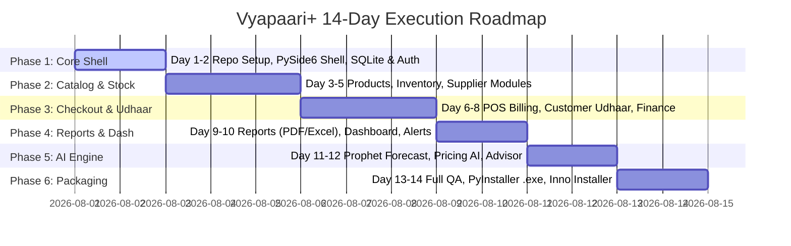

<p align="center">
  
</p>

# Vyapaari+ — Windows Desktop Business Operating System

[](https://python.org)
[](https://wiki.qt.io/Qt_for_Python)
[](https://www.sqlalchemy.org)
[](https://sqlite.org)
[](https://facebook.github.io/prophet/)
[](https://pyinstaller.org)
[](LICENSE)

> **Vyapaari+** by **Tech Tomorrow** is an AI-first, 100% Python Windows Desktop Operating System for Indian MSMEs. It replaces notebooks, calculators, Excel, WhatsApp reminders, and fragmented billing software with one offline-capable desktop application.

---

## 🎯 The Problem — Why Vyapaari+ Exists

Walk into any local Indian shop — a kirana store, medical shop, or hardware dealer — and the owner is juggling five disconnected tools:
- **Notebook (Khata):** Tracking who owes what (Udhaar)
- **Calculator:** Calculating daily totals manually
- **Excel:** Record-keeping for tech-savvy owners
- **WhatsApp:** Sending bills, reminders, and communicating with suppliers
- **Pirated Billing Tool:** Simply printing physical invoices

None of these systems communicate. Stock runs out without notice, profits quietly erode as purchase costs rise while selling prices remain static, and lost customers go unnoticed for months.

> **The Real Problem:** It isn't a lack of software — existing tools focus purely on **record keeping**, not **decision-making**. Nothing tells the shop owner what to do next.

---

## 🚀 The Vision

Vyapaari+ is a **desktop-first, AI-first Business Operating System**. Running locally on the shop's PC, it operates without requiring an internet connection for daily billing.

Instead of just recording transactions, Vyapaari+ answers the critical questions shop owners ask:
- *What should I reorder today?*
- *Which products are cutting into my profit margin?*
- *Which customers haven't returned in 30 days?*
- *What actions should I take to grow my business this month?*

---

## 🛠️ Complete Tech Stack (100% Python Desktop)

| Component | Technology | Purpose |
| :--- | :--- | :--- |
| **Desktop UI** | **PySide6 (Qt for Python)** | Main GUI window, POS screen, dashboards, and input forms. |
| **Styling** | **QSS (Qt Style Sheets)** | Modern, clean UI styling without HTML/CSS browser runtimes. |
| **Data Visualization** | **Matplotlib / PyQtGraph** | Native embedded charts for sales trends and profit graphs. |
| **Core Runtime** | **Python 3.12** | In-process service layer (no web server required). |
| **Database & ORM** | **SQLAlchemy 2.0 + SQLite** | Local embedded SQLite storage with Alembic migration support. |
| **AI & ML Engine** | **Pandas, NumPy, Scikit-Learn, Prophet** | In-process forecasting and demand prediction algorithms. |
| **AI Advisor** | **OpenAI API / Local Ollama** | Conversational business advisor with offline fallback. |
| **Document Processing** | **Tesseract OCR (`pytesseract`)** | Automatic bill and invoice scan parsing. |
| **Reports & PDF** | **ReportLab / openpyxl** | GST-compliant PDF invoice generation and Excel exports. |
| **Packaging & Distribution** | **PyInstaller + Inno Setup** | Single `.exe` bundle and standard Windows installer wizard. |

---

## 📦 System Architecture & Folder Structure

 Vyapaari+ follows a **Modular Monolith Architecture** with strict 3-layer separation (`Screen` → `Service` → `Repository`) inside a single desktop application process.

```text
vyapaari-plus/
├── app/
│   ├── main.py              # Application entrypoint (launches QApplication)
│   ├── config.py            # Settings (paths, constants, SQLite connection)
│   │
│   ├── core/                # Cross-cutting concerns (no business logic)
│   │   ├── security.py      # Password hashing, token utility
│   │   ├── exceptions.py    # Custom domain exceptions
│   │   ├── logging.py       # Structured application logging
│   │   └── permissions.py   # RBAC permission checks
│   │
│   ├── db/                  # Database Persistence Engine
│   │   ├── base.py          # SQLAlchemy 2.0 Declarative Base
│   │   ├── session.py       # SQLite Session Factory & DB init
│   │   └── mixins.py        # TimestampMixin, SoftDeleteMixin, UUIDMixin
│   │
│   ├── modules/             # ⭐ DOMAIN BUSINESS MODULES
│   │   ├── auth/            # Login, password reset, RBAC roles
│   │   ├── business/        # Shop profile, GST, branch settings
│   │   ├── products/        # Catalog, barcodes, MRP, GST categories
│   │   ├── inventory/       # Stock tracking, transfers, expiry alerts
│   │   ├── billing/         # POS checkout, PDF invoices, discounts
│   │   ├── customers/       # Ledger, Udhaar credit, loyalty points
│   │   ├── suppliers/       # Purchase orders, vendor payables
│   │   ├── employees/       # Attendance, payroll, staff permissions
│   │   ├── finance/         # Expense tracking, cashbook, P&L analytics
│   │   └── reports/         # Export handlers (PDF/Excel)
│   │                        # (Each module contains: models.py, service.py, repository.py)
│   │
│   ├── ai/                  # 🧠 EMBEDDED AI PIPELINE ENGINE
│   │   ├── forecasting/     # Prophet sales & stock prediction
│   │   ├── recommendations/ # Dynamic pricing recommendation engine
│   │   ├── insights/        # Dead stock detection, profit anomaly analysis
│   │   ├── advisor/         # Conversational business advisor (LLM/Ollama)
│   │   └── ocr/             # Invoice OCR parser (Tesseract)
│   │
│   ├── ui/                  # 🎨 PYSIDE6 / QT GRAPHICAL INTERFACE
│   │   ├── main_window.py   # Shell window & navigation drawer
│   │   ├── screens/         # Login, POS Billing, Products, Customers, Reports
│   │   ├── widgets/         # Reusable tables, metric cards, embedded charts
│   │   └── styles/          # QSS stylesheets & themes
│   │
│   └── resources/           # Assets (App icons, logo, fonts)
│
├── assets/                  # Project media & banners
│   └── banner.jpg           # Official Vyapaari+ Banner Image
├── alembic/                 # Database schema migrations
├── tests/                   # Automated unit & integration tests
│   ├── unit/
│   ├── integration/
│   └── conftest.py
├── build/                   # Build Manifests
│   ├── vyapaari.spec        # PyInstaller build spec file
│   └── installer.iss        # Inno Setup Windows installer script
├── pyproject.toml           # Tooling & dependency configuration
├── .env.example             # Template for configuration keys
└── README.md
```

---

## 🏛️ Clean Architecture Contract (3-Layer Pattern)

Every Qt Screen operates as the presenter layer, routing requests directly to in-process service instances:

```text
Qt Screen (ui/screens/pos_billing.py)
   │ (Validates GUI inputs with Pydantic)
   ▼
Service Layer (modules/billing/service.py)
   │ (Executes business rules: stock checks, GST calculation)
   ▼
Repository Layer (modules/billing/repository.py)
   │ (Executes SQLAlchemy SQLite transactions)
   ▼
Local Database (vyapaari.db)
```

> **Key Rule:** Screens contain zero business logic. All business rules reside in `service.py`, making 100% of business logic unit-testable without rendering a single window.

---

## 📋 Comprehensive Module Breakdown

| Module | Core Functional Scope |
| :--- | :--- |
| **Authentication** | User login, role-based access control (Admin, Cashier, Manager), session management. |
| **Business Setup** | Shop profile, address, GSTIN, invoice branding, multi-branch configuration. |
| **Product Catalog** | Items, categories, barcode generation, HSN/SAC codes, MRP vs. Selling Price. |
| **Inventory** | Stock in/out logs, warehouse management, low-stock warnings, batch expiry tracking. |
| **Billing (POS)** | Touch-friendly POS interface, barcode scanner input, cash/online payments, instant PDF bills. |
| **Customers** | Customer ledger, **Udhaar (Credit) tracking**, automated WhatsApp payment reminders. |
| **Suppliers** | Vendor profiles, purchase orders, payable balances, stock entry. |
| **Employees** | Staff attendance, salary calculation, role-specific action permissions. |
| **Finance** | Expense recording, daily cashbook, net profit/loss calculation. |
| **Reports** | Daily/monthly sales summaries, GST tax reports, Excel/PDF exporter. |

### 🧠 Embedded AI Capabilities

- **AI Sales Prediction:** Prophet-based forecasting for future sales demand.
- **AI Inventory Reordering:** Calculates product depletion dates and suggests reorder quantities.
- **AI Dead Stock Detection:** Identifies slow-moving inventory tying up capital.
- **AI Pricing Recommendations:** Recommends optimal retail prices based on cost margins.
- **AI Profit Analysis:** Pinpoints products or categories causing profit margin drops.
- **AI Business Advisor:** Conversational Assistant ("Why is my net profit down this week?") backed by store data.

---

## 🗓️ 14-Day Full Software Development Plan



### Day-by-Day Execution Schedule

- **Day 1:** Repository setup, PySide6 main window shell, QSS design system, SQLite base schema.
- **Day 2:** Authentication screen (Login/RBAC) & Business Setup wizard.
- **Day 3:** Product Management module (Screen + Service + Repository).
- **Day 4:** Inventory Management (Stock in/out, batch tracking, expiry alerts).
- **Day 5:** Supplier Management (Purchase orders, vendor accounts).
- **Day 6:** Billing / POS Screen (Barcode scanner, invoice generation, discounts).
- **Day 7:** Customer Management (**Udhaar Khata**, credit limit, payment history).
- **Day 8:** Financial Tracking (Daily expenses, cashbook, tax accounting).
- **Day 9:** Reports Module (Sales, GST reports, PDF/Excel export via ReportLab/openpyxl).
- **Day 10:** Dashboard Screen & System Notifications (Low stock, payment reminders).
- **Day 11:** AI Engine: Sales & Inventory demand forecasting (Prophet + PyQtGraph).
- **Day 12:** AI Engine: Pricing advisor, dead stock identification, LLM Business Advisor.
- **Day 13:** End-to-end integration testing, data validation, performance tuning.
- **Day 14:** PyInstaller `.exe` packaging, Inno Setup installer wizard, Beta release.

---

## 🛠️ Contribution & PR Workflow

We welcome contributions to Vyapaari+! Please follow our feature branch workflow:

### 1. Fork & Clone
```bash
git clone https://github.com/<your-username>/vyapaari-plus.git
cd vyapaari-plus
```

### 2. Create Feature Branch
```bash
git checkout -b feature/<module-name>-<your-name>
```

### 3. Implement & Test Locally
```bash
# Install development dependencies
pip install -r requirements.txt

# Run linting and type checks
ruff check .
mypy app

# Run unit test suite
pytest
```

### 4. Commit & Push
```bash
git add .
git commit -m "feat: implement <module-name> end-to-end"
git push origin feature/<module-name>-<your-name>
```

### 5. Submit Pull Request
Open a Pull Request to `mohitraj8503/vyapaari-plus:main`. Ensure your PR contains a **complete, fully-tested module** including screens, service logic, repository queries, and unit tests.

---

<p align="center">
  Developed with ❤️ for Indian MSMEs by <strong>Tech Tomorrow</strong>
</p>

---

Built by [Mohit Raj](https://github.com/mohitraj8503) — Technical Team Lead @ [Tech Tomorrow](https://techtomorrow.in)
